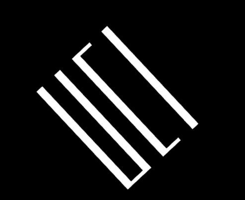

# web-gl-project

This is a rotating UCI logo I made while practicing with WebGL: 

In order to create this, first I put in all the coordinates I used for the letters 

	// draw UCI
	var vertices = [
		-0.95, 0.9, 0.0, //top left
		-0.95, -0.9, 0.0, //bottom left
		-0.9, 0.9, 0.0, //top right
		etc...

The 3rd number is always zero because it is a 2D project. The coordinates in grouped in 3's to make triangles. Then, I add color. These are all white 

	var colors = [
		1.0, 1.0, 1.0, 1.0,
		1.0, 1.0, 1.0, 1.0,
		1.0, 1.0, 1.0, 1.0,

Finally I repeatedly use matrix multiplication to translate the coordinates 

	var angle_in_radian = degToRad(rotatedDegrees);
	rotatedDegrees = (rotatedDegrees + 1) % 360;
	//console.log(rotatedDegrees);

	mat4.rotateZ(mvMatrix, mvMatrix, angle_in_radian);
	mat4.translate(mvMatrix, mvMatrix, [0.8, 0, 0]);
	mat4.scale(mvMatrix, mvMatrix, [1.3, 0.6, 1]);
